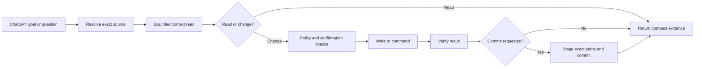

# Mastermind

Mastermind is a local-first control plane for using ChatGPT to work on your
own repositories, folders, and knowledge sources. ChatGPT provides the
conversation and reasoning surface; Mastermind keeps execution on the user's
computer, applies bounded operations, records evidence, and leaves the source
of truth in the user's workspace.

Mastermind is developed by ProChat. The product name is **Mastermind**.
Workbench and BuildFlow appear only as historical or technical compatibility
identifiers.

> Current beta: `1.3.25-beta`

## Why Mastermind exists

AI-assisted work becomes difficult to trust when the model cannot see the
right files, changes are made without a clear boundary, or a conversation is
the only record of progress. Mastermind separates the responsibilities:

```text
ChatGPT or another reasoning client
  -> chooses intent, scope, and acceptance criteria
Mastermind on the user's computer
  -> resolves an explicit source and performs bounded local operations
Workspace and Git
  -> remain the durable source of truth
```

The result is a practical local workflow for reading context, making reviewed
changes, running validation, and committing an exact scope without requiring
a second model API or a hosted execution service.

## What Mastermind does

Mastermind connects a reasoning client to user-owned local sources through a
small, guarded contract.

- Registers local repositories, folders, and knowledge sources.
- Indexes and searches bounded source content.
- Reads exact files, ranges, symbols, and task-focused context.
- Keeps each operation locked to an explicit `sourceId`.
- Applies guarded file creates, patches, appends, moves, and deletes.
- Runs allowlisted, source-scoped commands and returns bounded evidence.
- Submits and retrieves durable validation jobs where the command contract
  supports them.
- Creates explicit, scoped Git commits after validation and approval.
- Persists run, checkpoint, activity, and resume state for larger goals.
- Provides a native macOS application and a dashboard/CLI fallback path.

Mastermind is local-first, not local-only: the reasoning client may be remote,
but the selected source and the execution boundary remain under the user's
control.

## The five Custom GPT actions

The stable public schema exposes exactly five operations:

| Action | Purpose |
| --- | --- |
| `getMastermindStatus` | Read health, source discovery, and resume state. |
| `readMastermindContext` | Read bounded repository context, files, symbols, and search results. |
| `applyMastermindFileChange` | Apply a guarded file change or start a bounded durable goal. |
| `commitMastermindChanges` | Create an explicit Git commit for approved paths. |
| `runMastermindCommand` | Run a bounded repository command or inspect validation evidence. |

The canonical endpoint is:

```text
https://mastermind.prochat.tools
```

`https://workbench.prochat.tools` is a compatibility endpoint for existing
configurations. New integrations should use the Mastermind endpoint.

Every repository action requires an exact enabled `sourceId`. A dashboard's
active source is a convenience for local UI, not implicit permission for a
Custom GPT action.

## How a request moves through Mastermind



The action layer is intentionally short and fail-fast. Larger work is not
implemented by keeping one HTTP request open indefinitely. Goal Mode stores a
bounded plan, packet, validation policy, and continuation state, then exposes
compact checkpoints for the reasoning client.

## Quick Mode and Goal Mode

### Quick Mode

Use Quick Mode for a focused question, a small read, a narrow edit, or a single
validation command. The normal pattern is:

1. Lock the conversation to one exact source.
2. Read only the needed context.
3. Preview or confirm a guarded change when required.
4. Validate the result and report the evidence.

### Goal Mode

Use Goal Mode for a feature, refactor, documentation pass, or other bounded
multi-step objective. A goal records its expected outcome, scope, constraints,
non-goals, stop conditions, validation, and commit intent. Mastermind can then
resume from persisted state after a conversation or process interruption.

Goal Mode is bounded and observable. It does not grant unrestricted terminal
access, silently broaden scope, or make a default push.

## Source and workspace management

The local runtime can manage more than one user-owned source. A source has an
identity, a local root, and index/health state. Git checkouts and linked
worktrees may be grouped for dashboard navigation, but an action still names
the exact source it may access.

The public workflow is deliberately explicit:

- discover sources when the source is unknown;
- select one exact source ID;
- keep that source locked until the user changes it;
- reject placeholders such as `default`, `workspace`, `current`, and `repo`;
- treat stale indexes as navigation aids, then verify exact files before edits.

## Context, writes, commands, and Git

`readMastermindContext` supports bounded task-context preparation, exact path
reads, line ranges, symbols, literal or tightly bounded search, and cached
navigation metadata when available. Search and index results help locate
content; they are not proof that a write is safe.

`applyMastermindFileChange` accepts guarded repository-relative operations. It
supports dry runs, exact patches, verification, and confirmation-gated
operations. Protected paths, secrets, environment files, private keys, Git
metadata, vendor output, and other unsafe boundaries are rejected by policy.

`runMastermindCommand` is an owner-scoped command boundary. Commands are
bounded, redacted, and evaluated inside the selected source root. Validation
jobs return persisted IDs and bounded result pages so a lost response can be
reconciled without submitting duplicate work.

`commitMastermindChanges` stages explicit paths only. Validation should pass
before a commit, commit messages are explicit, and automatic push is disabled
by default.

## Native macOS application

The repository includes a first-party native macOS application for the local
fast path. The app and its owner-local helper share the same Mastermind goal,
source, policy, and validation model as the Custom GPT path; the app is not a
second execution engine.

The native runtime exposes its local ingress on `127.0.0.1:3154`. The macOS
settings and status surfaces report helper, portable host, source, and ingress
health. The repository also provides `mastermindctl` lifecycle commands for
status, doctor, restart, upgrade, and rollback.

The native GUI is currently a macOS surface. Other platforms can use the local
dashboard, CLI, or the public action contract where their runtime is
configured.

## Installation and first run

The public repository is source-distributed. It is not an npm package and does
not provide a hosted execution service.

```bash
git clone https://github.com/prochattools/mastermind.git
cd mastermind
pnpm install
pnpm --dir packages/cli build
pnpm --dir packages/cli type-check
```

For the local dashboard/runtime path:

```bash
pnpm local:start
pnpm local:verify
```

For the native macOS development path, use the repository's controlled
build/install lifecycle:

```bash
pnpm macos:build
pnpm macos:prepare-owner-local
pnpm macos:install
pnpm macos:status
pnpm macos:doctor
```

The install command consumes the generated owner-local release manifest and
preserves the lifecycle's rollback protections. The exact native path depends
on macOS permissions and the local controller state; `macos:doctor` is the
first diagnostic when status is not healthy.

To connect a Custom GPT, import [`docs/openapi.chatgpt.json`](docs/openapi.chatgpt.json)
or fetch `/api/openapi` from your reachable HTTPS endpoint. Configure bearer
authentication with the owner-configured Action Token, then apply the
instructions in [`docs/CUSTOM_GPT_INSTRUCTIONS.md`](docs/CUSTOM_GPT_INSTRUCTIONS.md).
Test status, one exact read, a write dry run, and only then an approved write.

## Documentation map

- [`docs/installation.md`](docs/installation.md) — source, dashboard, macOS,
  and Custom GPT setup.
- [`docs/architecture.md`](docs/architecture.md) — runtime boundaries,
  actions, sources, context, and durable goals.
- [`docs/safety.md`](docs/safety.md) — authority, path, command, Git, and
  confirmation boundaries.
- [`docs/troubleshooting.md`](docs/troubleshooting.md) — bounded recovery for
  connectivity, source, index, and native-runtime issues.
- [`docs/CUSTOM_GPT_INSTRUCTIONS.md`](docs/CUSTOM_GPT_INSTRUCTIONS.md) —
  canonical Custom GPT behavior.
- [`docs/openapi.chatgpt/README.md`](docs/openapi.chatgpt/README.md) — action
  schema import guide.
- [`docs/product/README.md`](docs/product/README.md) — public product scope
  and feature notes.

## Architecture

The portable core owns source identity, policy, bounded operations, evidence,
validation, durable state, and compact projections. Adapters provide the
dashboard, CLI, native macOS helper, Custom GPT transport, and optional
context/index providers.

```text
Reasoning client
  -> five-action transport
  -> local Mastermind application/runtime
      -> source registry and index
      -> context broker
      -> guarded write and command boundaries
      -> validation and evidence store
      -> Git adapter
      -> dashboard / CLI / native macOS projections
  -> user's repository, folder, or knowledge source
```

Optional providers must fail visibly and degrade to a safe baseline. Mastermind
does not require a local model, a second model API, or a particular AI vendor
for ordinary local workflows.

## Safety model

Mastermind is designed for explicit authority and observable execution:

- exact source identity is required;
- requests and responses are bounded;
- writes are repo-relative, policy-checked, and verified;
- sensitive and protected paths are blocked;
- consequential operations may require user confirmation;
- commands are source-scoped and bounded;
- validation evidence is persisted and redacted;
- Git stages exact paths rather than the whole worktree;
- push is never the default;
- failures return a blocker or safe partial result instead of pretending the
  operation completed.

Review the full boundaries in [`docs/safety.md`](docs/safety.md) before
connecting a Custom GPT to a source with sensitive material.

## Limitations and compatibility

Mastermind is a beta local tool. It does not promise unrestricted autonomous
coding, background work after the local runtime is stopped, silent source
switching, automatic conflict resolution, or hosted multi-user execution.
Indexes can be stale, optional providers can be unavailable, and an external
Custom GPT client still imposes request, response, authentication, and
availability constraints.

Compatibility aliases remain in code and existing installations while the
public contract uses Mastermind names. Do not use legacy names for new Custom
GPT configuration.

## Contributing and licensing

See [`CONTRIBUTING.md`](CONTRIBUTING.md) for development checks and
[`SECURITY.md`](SECURITY.md) for responsible disclosure. The public source is
licensed under [`AGPL-3.0-only`](LICENSE); trademark and separate commercial
licensing information is in [`TRADEMARKS.md`](TRADEMARKS.md) and
[`COMMERCIAL-LICENSING.md`](COMMERCIAL-LICENSING.md).
